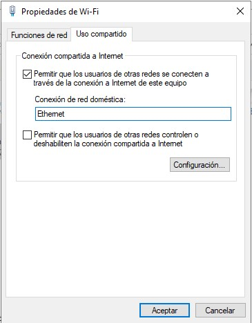
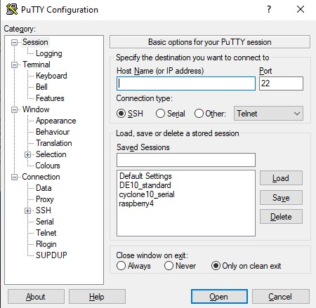

## ¿Cómo compartir internet a la Raspberry Pi?

### Ethernet

1. Conectar la computadora y la Raspberry Pi por medio de cable ethernet
2. En tu computadora ir a **Panel de Control** > **Redes e Internet**

3. **Centro de redes y recursos compartidos** 

4. **Cambiar configuración del adaptador** 

5. Clic derecho en **WiFi** > **Propiedades** 

6. **Uso compartido** > Seleccionar **Permitir que los usuarios de otras redes se conecten ...** > **Aceptar** 

### SSH

Antes de conectar la Raspberry Pi por SSH se necesitan descargar algunos programas: [Nmap](https://nmap.org/) y [PuTTY](https://www.putty.org/) 

1. Conectar por ethernet la Raspberry Pi y la computadora
2. Conectar monitor y mouse a Raspberry Pi.
3. Ir a **Menu** > **Preferences** > **Raspberry Pi Configuration** > **Interfaces** > Habilitar **SSH** y **VNC**

4. Apagamos la tarjeta

5. Abrimos una terminal desde nuestra computadora y escribimos lo siguiente: `nmap -v -sn 192.168.137.1/24`. Lo anterior es para identificar la dirección IP a la cual se conectó la tarjeta. También podemos escribir `nmap 192.168.137.1/24` para obtener un reporte más detallado.

6. Abrir **PuTTY** > Ingresar dirección **IP** > Marcar la casilla de **SSH**

7. Después se abrirá la siguiente ventana

Aquí debemos ingresar el usuario y contraseña de Raspbian.

En caso de que aparezca lo siguiente `Wi-Fi is currently blocked by rfkill` ejecutamos lo siguiente `sudo raspi-config` y ahora se abrirá la ventana siguiente:

Seleccionamos **Localisation Options** > **WLAN Country** > Seleccionar país.

8. Abrir **VNC Viewer** > Ingresar la dirección IP de la Raspberry Pi

9. Se abrirá una pestaña e ingresamos usuario y contraseña de Raspbian

10. Finalmente visualizaremos el escritorio de Raspbian y estaremos conectados via SSH

