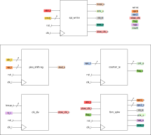
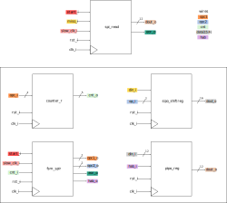
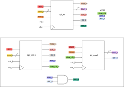

**Autor: Julisa Verdejo Palacios**

# SPI Driver

## ADC ADS7841E

El ADS7841 es un convertidor analógico digital que cuenta con las siguientes características:

* Alimentación de 2.7 - 5 V
* 4 canales
* Puede ser utilizado en modo de 8 o 12 bits
* Las terminales más importantes son: DCLK, CS, DIN y DOUT.
* Se necesita de un comando de 8 bits para controlarlo

El convertidor es controlado por un dispositivo master, este puede ser una FPGA o un microcontrolador, en nuestro caso utilizaremos la primera opción y una vez generado el código en verilog para controlar el ADC, la conexión entre la FPGA y el convertidor se ve de la siguiente manera:

Para entender mejor como se debe controlar el ADS7841 es necesario observar y analizar el diagrama de tiempos de este convertidor, cabe mencionar que dependiendo del voltaje con el que se alimente el convertidor tendrá diferentes especificaciones de tiempo, en nuestro caso el convertidor se alimenta con 3.3V, por lo tanto usaremos las especificaciones de 2.7V.

 La comunicación entre el master y el slave consta de 8 ciclos de DCLK.

El comando para controlar el ADC está conformado por:

| Bit 7 (MSB) | Bit 6 | Bit 5 | Bit 4 | Bit 3 | Bit 2   | Bit 1 | Bit 0 (LSB) |
| ----------- | ----- | ----- | ----- | ----- | ------- | ----- | ----------- |
| S           | A2    | A1    | A0    | MODE  | SGL/DIF | PD1   | PD0         |

S : Start bit, este debe estar en 1

A2 - A0 : Son los bits que indican el canal que se leerá

MODE : Si está en 1 indica que el convertidor se usará en el modo de 8 bits, si es 0 será de 12 bits

SGL/DIF : Bit que selecciona entre single-ended/differential, si está en 1 será el primero, si es 0 será el segundo.

PD1 - PD0 : Bits de selección de modo de desconexión, si ambos están en 1 significa que el ADC siempre estará encendido.

Y antes de enviarlo se debe tomar en cuenta que cuando CS se pone en bajo se debe esperar un tiempo ($t_{BDV}$) máximo de 200ns para que BUSY se ponga en bajo y un tiempo ($t_{CSS}$) mínimo de 100ns para mandar el primer pulso de DCLK. El tiempo en bajo y alto ($t_{CH}$, $t_{CL}$) de DCLK debe ser mínimo de 200ns. Los primeros 8 ciclos de DCLK son usados para enviar el comando (mosi/DIN) y se necesita un ciclo extra para esperar a que la señal BUSY se ponga en alto, a partir de aquí comienza la conversión. Los siguientes 13 ciclos de DCLK corresponden a la conversión que proporciona el ADC, 3 ciclos extra son necesarios para completar el último byte. Finalmente cuando el CS vuelva a ponerse en alto, se tendrá que esperar un tiempo ($t_{BTR}$) máximo de 200ns para que BUSY pueda habilitarse. 

Una conversión completa dura 25 ciclos y medio de DCLK.

## 1. SPI: Escritura

La escritura del SPI consiste en enviar las siguientes señales al ADC:

*  `cmd_i` (comando)
* `dclk_o` 
*  `cs_o` 

### 1.1 piso_shiftreg

Registro de 8 bits con entrada en paralelo y salida en serie con desplazamiento a la izquierda. Este registro sirve para enviar el comando que controlará al ADC, la salida de este registro es el mosi (master out - slave in).

### 1.2 counter_w

Contador ascendente de 5 bits utilizado para contar los 25 ciclos de DCLK que toma la conversión. 

### 1.3 clk_div

Base de tiempo que genera pulsos cada 39 (`kmax_i`) ciclos de `clk_i`. Esta base de tiempo sirve para generar la base de tiempo cuadrada DCLK.

### 1.4 fsm_spiw

## 2. SPI: Lectura

### 2.1 counter_r

### 2.2 sipo_shiftreg

### 2.3 fsm_spir

### 2.4 pipo_reg

## 3. SPI: Escritura-Lectura

## 4. Selector de canal de ADC.

## 5. Máquina de estados principal

## 6. Button check

## 7. Módulo top

